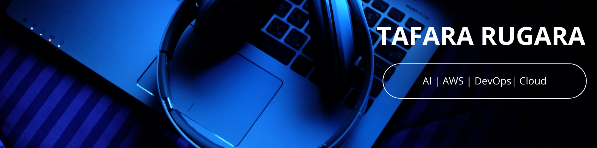

# 👋🏽 Hey, I'm Tafara —Jr Cloud & DevOps Engineer 

I automate deployments, accelerate Software delivery and releases to end users reliably.

I build scalable, cost-efficient cloud infrastructure

I thrive at the intersection of **DevOps,Cloud ,backend engineering, and applied AI** — where workflows become autonomous, and business value is met.

Check out my project repos : https://github.com/98Devops?tab=repositories
---

## 🧰 Skills & Tools

### ☁️ Cloud & DevOps
- DigitalOcean, AWS , Docker, Docker Compose, Linux 
- Kubernetes, Terrafrom, Github Actions, Version Control,   
- System Architecture, Workflow Automation, API Orchestration (n8n)  
- CI/CD Fundamentals, Syncthing File Synchronization
- API Intergration and Development  

### 🧠 AI & Machine Learning
- LLM Integration (Gemini via OpenRouter, Whisper)  
- Semantic Search & Text Embedding (`sentence-transformers`)  
- Vector Database Management (Qdrant)  
- Context Engineering, Prompt Design 

### 🧪 Other
- Problem Solving, System Design, Debugging, Independent Learning  
- Using LLMs as Development Copilots for debugging, context generation, and architectural decision-making  

---

📫 **Reach out:**  
- LinkedIn: https://www.linkedin.com/in/tafara-rugara-0627b819b/ 
- GitHub: https://github.com/98Devops 
- YouTube: https://www.youtube.com/@techwithtaf
- Email: tfrsuperfx@gmail.com

